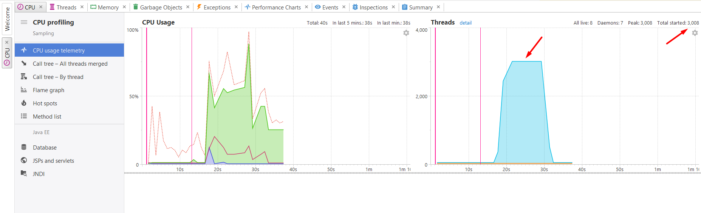
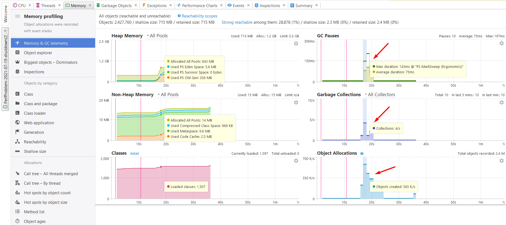

## Performance tickets

Запуски осуществлялись при значении параметра 10 000.

### Количество используемых параллельных потоков больше числа процессоров

- Программа задействует пул потоков с очень большим начальным числом (3000), эти потоки конкурируют за физические процессоры.



Ожидаемое поведение: программа задействует количество потоков по числу ядер.

См. CPU.snapshot

### При работе программы генерируется большое количество временных неиспользуемых объектов

- Программа выделяет большое количество экземляров BigIntegerIteratorAfterFix и лямбда-выражений (снепшот HeapDump.snapshot).


- Большое количество времени уходит на сборку мусора.



### Неэффективные структуры данных

- Коллекция `primeNumbers` не участвует в параллельной работе, поэтому делать этот список `synchronizedList` не имеет смысла (все операции этого класса помечены synchronized).


### Control-flow на базе исключений

- Вместо простого условия порождаются и отлавливаются исключения. Порождение исключений и наполнение стека занимает много времени.
```
try {
    isPrime(primeNumbers, candidate);
} catch (Exception e) {
    primeNumbersToRemove.add(candidate);
}
```